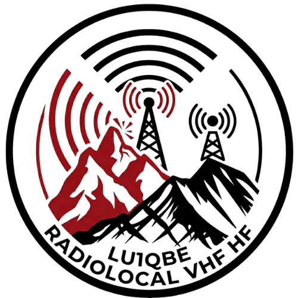
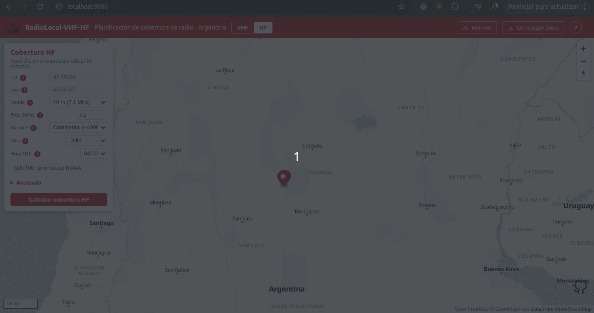
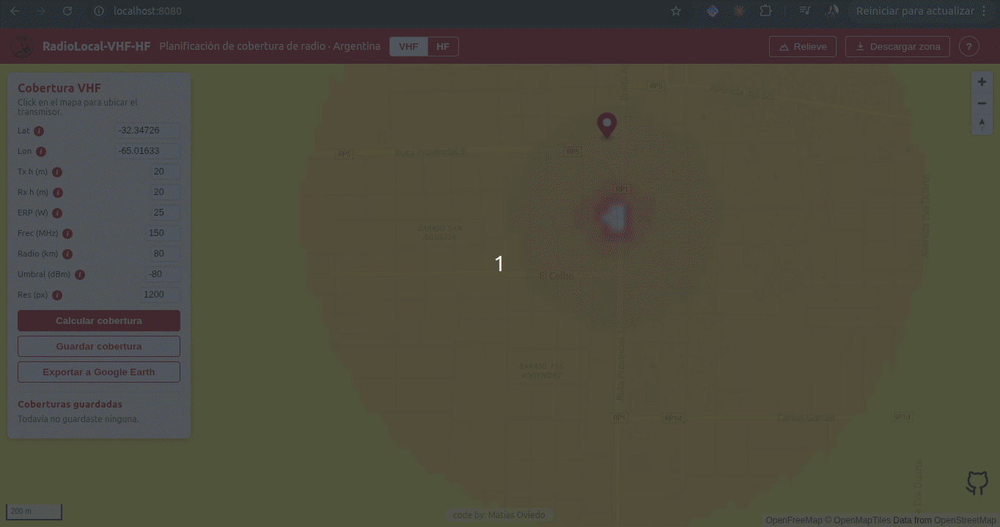
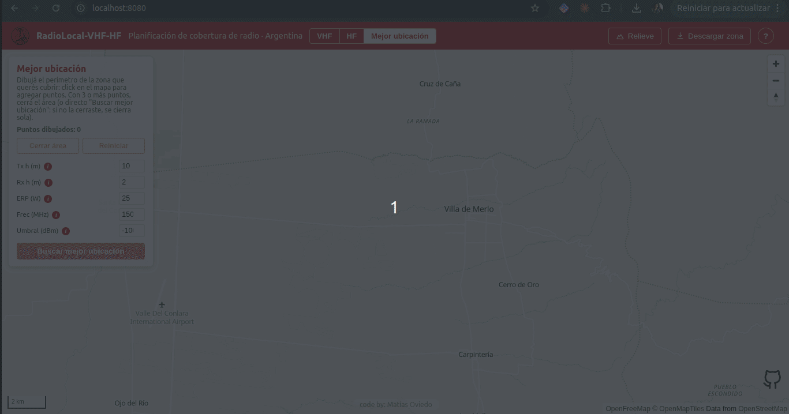
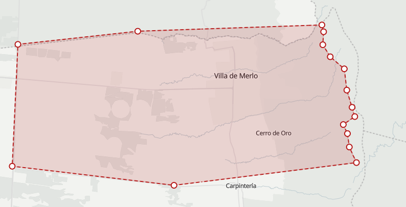
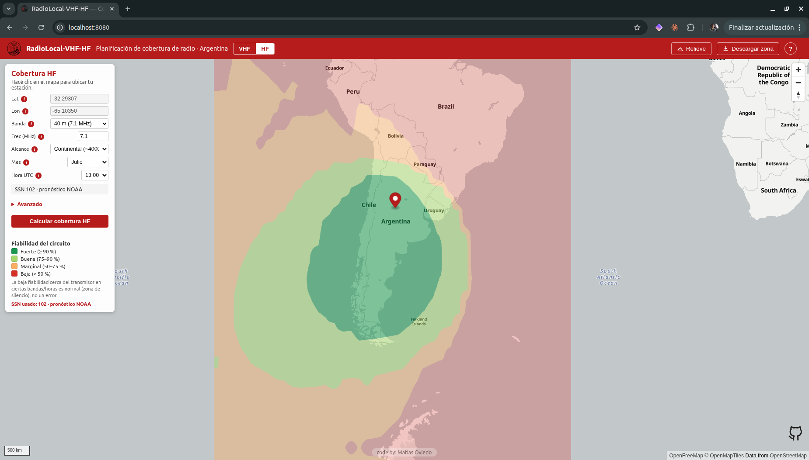
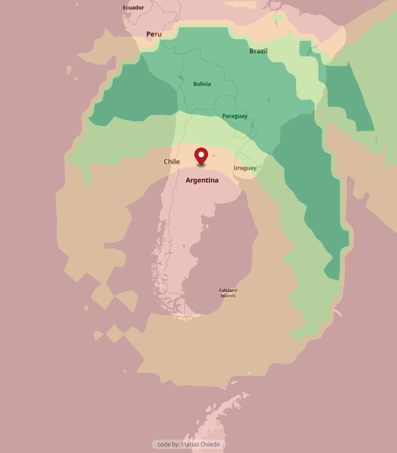
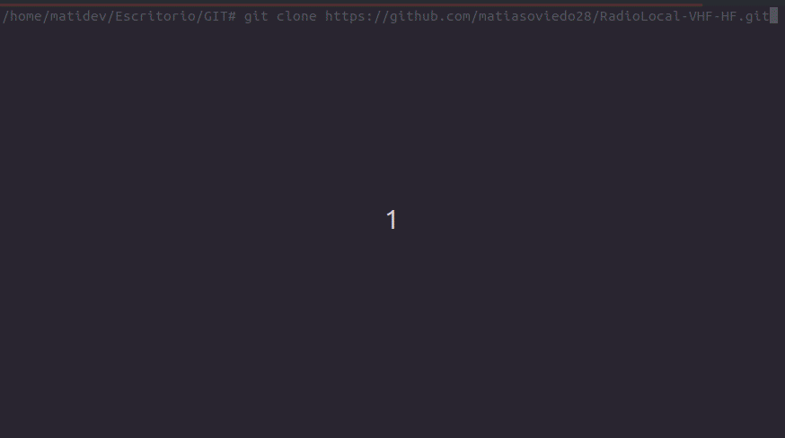
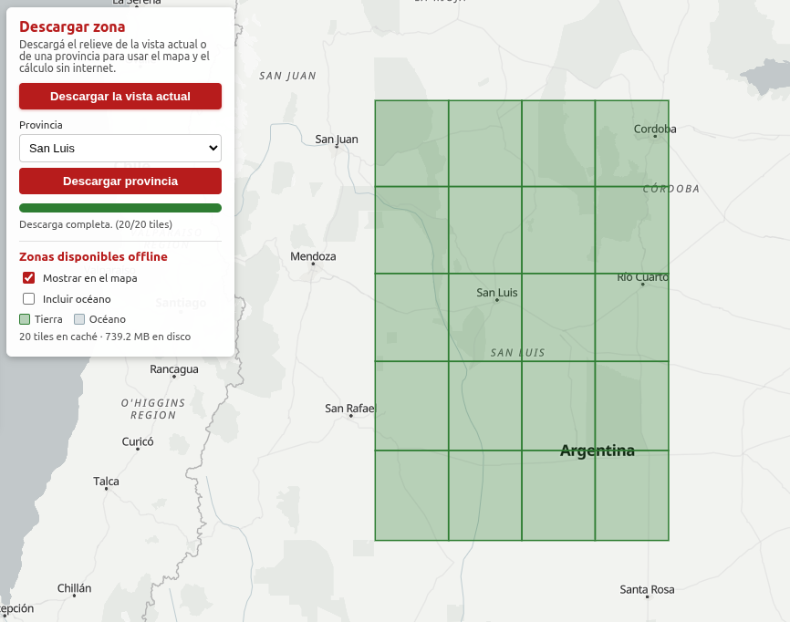

<p align="center">
  
</p>

# RadioLocal-VHF-HF

*This document is also available in English: [README_english.md](README_english.md).*

[](https://www.python.org/)
[](https://fastapi.tiangolo.com/)
[](https://rasterio.readthedocs.io/)
[-f57c00)](https://github.com/W3AXL/Signal-Server)
[-8e44ad)](https://github.com/ITU-R-Study-Group-3/ITU-R-HF)
[](https://maplibre.org/)
[](https://registry.opendata.aws/copernicus-dem/)
[](https://docs.docker.com/compose/)
[](https://github.com/matiasoviedo28/RadioLocal-VHF-HF)
[](LICENSE)
[](https://youtu.be/LfRk-zBDxqQ)


## Video completo sobre el proyecto.

> 📺 **Entrevista en Lima Whisky** VIDEO EN YOUTUBE: https://youtu.be/QQFW0WKfolc?t=2595

Herramienta para **planificar la cobertura de radio VHF y HF**, corriendo en tu
propia máquina, con una interfaz simple e intuitiva. Pensada tanto para **servicios
de emergencia** como para **radioaficionados de todo el mundo**.



---

## Qué es, de dónde nace y para qué sirve

Saber, antes de salir, hasta dónde va a llegar la radio es clave: qué cerros tapan
la señal en VHF, qué zonas quedan sin cobertura, dónde conviene ubicar una
repetidora, o con qué banda y a qué hora se puede establecer un enlace de larga
distancia en HF. Las herramientas web que hacen esto son online y dependen de
servicios de terceros: justo lo que no querés cuando estás coordinando
comunicaciones en el campo.

RadioLocal-VHF-HF nace de esa necesidad: una herramienta **propia y local** para
planificar comunicaciones sin depender de una web externa al momento de calcular.
El cálculo de propagación corre **siempre en tu máquina**, y los datos que necesita
(relieve, condiciones solares) se descargan una vez y quedan **cacheados** para
funcionar después aunque no haya internet.

Trabaja en **dos modos**:

- **VHF** — cobertura local sobre **relieve real** (line-of-sight, terreno, cerros).
  Ideal para planificar enlaces y repetidoras en una zona.
- **HF** — cobertura de **larga distancia** por reflexión ionosférica. Muestra la
  fiabilidad del enlace por **banda**, **mes** y **hora**, sobre miles de kilómetros.

**Para quién:**

- **Servicios de emergencia** (bomberos, Protección Civil, defensa civil): planificar
  comunicaciones en operativos, ubicar repetidoras, anticipar zonas sin señal.
- **Radioaficionados de todo el mundo**: estimar el alcance de una estación en VHF
  sobre terreno real, y en HF planificar contactos locales o DX según banda, hora y
  actividad solar.

> Funciona en cualquier parte del mundo: el relieve es global (Copernicus GLO-30) y
> el modelo HF (ITU-R P.533) es un estándar internacional.

---

## Capacidades

- **Cálculo de cobertura VHF** con **Signal-Server** (modelo **Longley-Rice / ITM**),
  corriendo **100% local**. Click en el mapa para ubicar el transmisor y un formulario
  para los parámetros (altura de antena, ERP, frecuencia, radio de cálculo).



- **Mejor ubicación**: dibujá en el mapa el perímetro de la zona que querés cubrir
  (click para agregar puntos; se cierra solo si no lo cerrás a mano) y la
  herramienta busca las coordenadas que mejor la cubren. Corre en dos etapas: un
  barrido rápido por line-of-sight sobre el relieve real (que además busca en un
  anillo alrededor del perímetro, porque en terreno montañoso el mejor punto suele
  ser un cerro fuera del valle a cubrir) y un refinamiento con el motor VHF real
  sobre los candidatos con mejor puntaje. El resultado se marca en el mapa junto
  con su cobertura.





- **Cálculo de cobertura HF** con **ITURHFProp** (implementación de referencia de la
  **ITU-R P.533**), también **100% local**. Mapa de **área** con la fiabilidad del
  circuito por **banda** (80–10 m, o frecuencia libre), **mes** y **hora (UTC)**, con
  **alcance seleccionable** (regional / continental / DX). El **número de manchas
  solares (SSN)** se obtiene automáticamente del pronóstico de **NOAA/SWPC**, con
  fallback offline y override manual.





- **Relieve (DEM) real** de **Copernicus GLO-30** (30 m), descargado on-demand desde
  el **bucket público de Copernicus en AWS**, **sin API key** (OpenTopography queda
  como fallback opcional).

- **Caché local de relieve por tiles** (1°×1°, guardados como COG en `data/dem/`): una
  zona ya descargada no vuelve a bajarse y queda disponible aunque no haya internet.

- **HF offline de fábrica**: los datos ionosféricos del modelo vienen embebidos en la
  imagen, así que el cálculo HF funciona sin internet desde el arranque; sólo el SSN
  quiere conexión (y tiene fallback).

- **Exportar a Google Earth (KMZ)**: descargá una cobertura como archivo `.kmz`
  autocontenido (imagen + parámetros + pin del transmisor) y abrila drapeada sobre el
  terreno 3D de Google Earth.

- **Descarga masiva por región** (CLI): bajá un área grande para trabajar con VHF
  **100% offline** (ver [Descarga masiva / uso offline](#descarga-masiva--uso-offline)).

- **Mapa interactivo** con **MapLibre GL JS** y sombreado de relieve (*hillshade*).

- **Despliegue con Docker Compose**: backend (FastAPI) + frontend (nginx + MapLibre)
  arrancan juntos con un solo comando.

---

## Requisitos

- **Docker** y Docker Compose. Guías oficiales de instalación:
  - **Ubuntu:** https://docs.docker.com/engine/install/ubuntu/
  - **Windows:** https://docs.docker.com/desktop/setup/install/windows-install/
- **Conexión a internet** sólo para obtener datos frescos la primera vez: el **relieve**
  de la zona (VHF) y el **SSN** de NOAA (HF). Después ambos quedan cacheados y funcionan
  offline. **No hace falta API key.**

---

## Cómo levantar el proyecto

> 📺 **¿Preferís verlo en video?** Tutorial completo paso a paso (Windows, sin necesitar
> saber programar): https://youtu.be/LfRk-zBDxqQ

1. **Cloná el repositorio:**

   ```bash
   git clone https://github.com/matiasoviedo28/RadioLocal-VHF-HF.git
   cd RadioLocal-VHF-HF
   ```

2. **Levantá los servicios:**

   ```bash
   docker compose up -d --build
   ```

3. **Abrí la app** en el navegador: **http://localhost:8080**

   

4. **Usá la app.** No hace falta configurar nada:
   - En **VHF**: acercá el zoom a tu zona, usá **"Descargar zona"** (baja el relieve la
     primera vez) y calculá la cobertura.
   - En **HF**: cambiá al modo **HF** en la barra superior, ubicá tu estación con un
     click, elegí banda / mes / hora / alcance y calculá. El SSN se completa solo.

> **¿Querés trabajar VHF offline en el campo?** Bajá una región entera de una con el
> comando de [Descarga masiva](#descarga-masiva--uso-offline) y llevate la carpeta
> `data/dem/`. (El modo HF ya funciona offline sin pack.)

> **Fallback de relieve (opcional).** Además del bucket público de Copernicus, se puede
> usar **OpenTopography** como fuente alternativa poniendo
> `RADIOLOCAL_DEM_SOURCE=opentopography` en `.env` (requiere una API key gratuita). En
> el flujo por defecto **no se usa**.

---

## Descarga masiva / uso offline

Para operativos VHF sin conectividad podés armar un **"pack" de relieve** de una región
de una sola vez, y después usar terreno + cobertura **100% offline**. Lo prepara **una
persona** (con internet) y comparte la carpeta `data/dem/`.

El método por **caja de coordenadas (bbox) funciona en cualquier parte del mundo**:

```bash
# Por caja de coordenadas: SUR OESTE NORTE ESTE (en cualquier parte del mundo)
docker compose exec backend python -m app.tools.descargar_region --bbox -42 -72 -40 -70

# Ajustar la concurrencia a tu conexión (default 6)
docker compose exec backend python -m app.tools.descargar_region --bbox -42 -72 -40 -70 --concurrency 8
```

También hay **atajos por provincia/país** (`--provincia`, `--pais`) con presets
incluidos para Argentina:

```bash
docker compose exec backend python -m app.tools.descargar_region --provincia "tierra del fuego"
docker compose exec backend python -m app.tools.descargar_region --pais argentina
```

La herramienta es **reanudable** (saltea lo ya descargado), reintenta ante fallos de red,
muestra el progreso (`[45/520] …`) y verifica la completitud al final. Los tiles que caen
en el mar se generan como **océano sintético** (plano, a nivel del mar) sin pegarle a la red.

**Modelo de pack (tamaños aproximados):**

| Alcance            | Tamaño aprox. |
|--------------------|---------------|
| Región chica       | cientos de MB |
| País entero        | ~15–25 GB     |

Una vez armado el pack, copiá la carpeta `data/dem/` a la máquina de campo (o compartila):
ahí el relieve y el cálculo de cobertura VHF funcionan sin internet.

Desde el panel **Descargar zona** podés activar *"Mostrar en el mapa"* para ver qué áreas
ya tenés disponibles offline, resaltadas sobre el mapa:



---

## Versiones

- **beta** — Plantilla inicial: esqueleto del proyecto (Docker Compose, mapa base,
  estructura backend/frontend).
- **1.1.0** — VHF funcional: cálculo de cobertura VHF (Longley-Rice) sobre relieve
  Copernicus, uso offline, exportación a Google Earth (KMZ) e interfaz simple.
  **Probado en el campo y comparado con mediciones reales.**
- **1.2.1** — Base HF: cobertura de área HF (ITU-R P.533) por banda, mes y hora,
  con SSN automático de NOAA y alcance seleccionable (regional / continental / DX).
- **1.3.4** — Mejor ubicación: dibujás el perímetro de la zona a cubrir y la
  herramienta busca el mejor punto para una repetidora (barrido por line-of-sight
  + refinamiento con el motor VHF real). Lanzador para Windows (`INICIAR.bat` /
  `APAGAR.bat`, sin usar la consola) con diagnóstico de virtualización desactivada
  en la BIOS.

---

## Licencia

El código de este proyecto está bajo licencia **MIT** (ver [LICENSE](LICENSE)).

Incluye componentes de terceros con sus propias licencias — Signal-Server (GPL v2)
e ITURHFProp (ITU-R) — detallados en
[THIRD_PARTY_LICENSES.md](THIRD_PARTY_LICENSES.md).

---

## Más información

- **[docs/ARQUITECTURA.md](docs/ARQUITECTURA.md)** — detalle técnico: servicios, motores
  RF (VHF y HF), esquema de caché, fuentes de datos y decisiones de arquitectura.

---

## Atribución y créditos

- **Relieve — Copernicus GLO-30** (DEM `COP30`): *Produced using Copernicus WorldDEM-30
  © DLR e.V. 2010-2014 and © Airbus Defence and Space GmbH 2014-2018 provided under
  COPERNICUS by the European Union and ESA; all rights reserved.* Los tiles se descargan
  del bucket público de Copernicus DEM en AWS
  ([AWS Open Data registry](https://registry.opendata.aws/copernicus-dem/),
  `copernicus-dem-30m`), de acceso anónimo y sin costo. Fuente alternativa opcional:
  **OpenTopography**.
- **Motor VHF — [Signal-Server](https://github.com/W3AXL/Signal-Server)** (modelo
  Longley-Rice / ITM).
- **Motor HF — [ITURHFProp / ITU-R P.533](https://github.com/ITU-R-Study-Group-3/ITU-R-HF)**,
  implementación de referencia de la ITU-R.
- **Datos solares (SSN) — NOAA / SWPC**, pronóstico del número de manchas solares suavizado.
- **Mapa — [MapLibre GL JS](https://maplibre.org/)**, tiles de
  [OpenFreeMap](https://openfreemap.org/) y datos de
  [OpenStreetMap](https://www.openstreetmap.org/copyright).