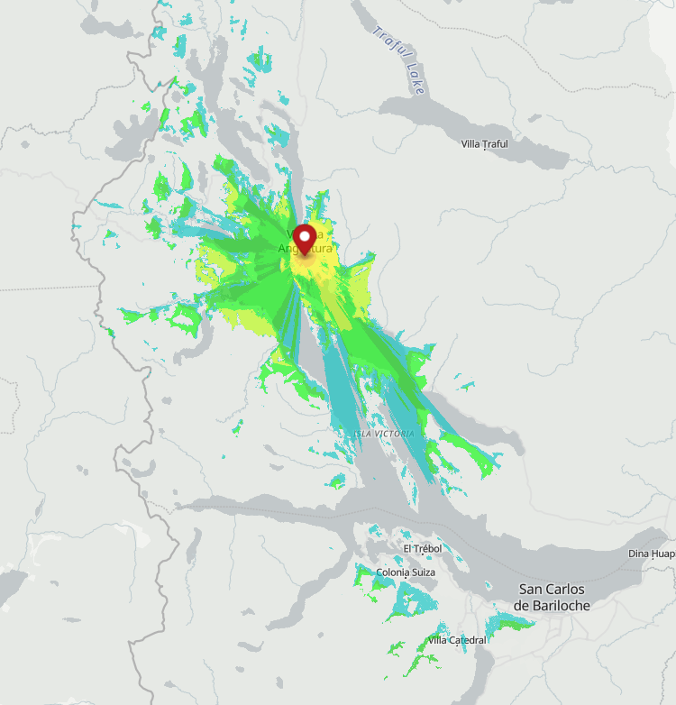
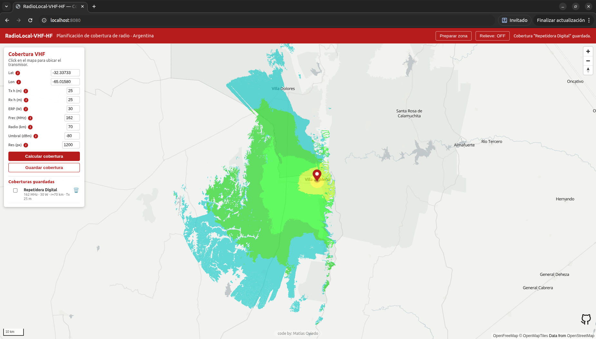

<p align="center">
  
</p>

# RadioLocal-VHF-HF

[](https://www.python.org/)
[](https://fastapi.tiangolo.com/)
[](https://rasterio.readthedocs.io/)
[](https://github.com/W3AXL/Signal-Server)
[](https://maplibre.org/)
[](https://registry.opendata.aws/copernicus-dem/)
[](https://docs.docker.com/compose/)
[](https://github.com/matiasoviedo28/RadioLocal-VHF-HF)

Herramienta para **planificar la cobertura de radio VHF** en operativos, calculada
sobre relieve real y corriendo en tu propia máquina con una interfaz amigable e intuitiva.



---

## Qué es, de dónde nace y para qué sirve

En operativos de **bomberos** y **Protección Civil** hace falta saber, antes de
salir, hasta dónde va a llegar la radio VHF desde un punto dado: qué cerros tapan,
qué zonas quedan sin señal, dónde conviene ubicar una repetidora. Las herramientas
web que hacen esto son online y dependen de servicios de terceros: justo lo que no
querés cuando estás coordinando comunicaciones en el campo.

RadioLocal-VHF-HF nace de esa necesidad: una herramienta **propia y local** para
planificar comunicaciones VHF sin depender de una web externa al momento de
calcular. El relieve se descarga una vez y queda **cacheado**; el cálculo de
propagación corre **siempre en tu máquina**.

**Para quién:**

- **Brigadas argentinas** de bomberos y Protección Civil que planifican
  comunicaciones en operativos.
- **Radioaficionados** que quieren estimar el alcance de una estación sobre
  terreno real.

> Estado actual: **Fase 2 — Motor RF VHF**. El módulo **HF** (propagación
> ionosférica) vendrá más adelante.

---

## Capacidades

Lo que la herramienta hace **hoy**:

- **Cálculo de cobertura VHF** con **Signal-Server** (modelo **Longley-Rice /
  ITM**), corriendo **100% local** dentro del backend. Click en el mapa para
  ubicar el transmisor y un formulario para los parámetros (altura de antena,
  ERP, frecuencia, radio de cálculo).
- **Relieve (DEM) real** de **Copernicus GLO-30** (30 m), descargado on-demand
  desde el **bucket público de Copernicus en AWS**, **sin API key**
  (OpenTopography queda como fallback opcional).
- **Caché local de relieve por tiles** (1°×1°, guardados como COG en `data/dem/`):
  una zona ya descargada no vuelve a bajarse y queda disponible aunque no haya
  internet.
- **Exportar a Google Earth (KMZ)**: descargá la cobertura actual o cualquiera de
  las guardadas como un archivo `.kmz` autocontenido (imagen + parámetros + pin del
  transmisor) y abrila drapeada sobre el terreno 3D de Google Earth.
- **Descarga masiva por región** (CLI): bajá una provincia o el país entero para
  trabajar **100% offline** (ver [Descarga masiva / uso offline](#descarga-masiva--uso-offline)).
- **Mapa interactivo** con **MapLibre GL JS** y sombreado de relieve
  (*hillshade*) para verificar visualmente el terreno.
- **Despliegue con Docker Compose**: backend (FastAPI) + frontend (nginx +
  MapLibre) arrancan juntos con un solo comando.



---

## Requisitos

- **Docker** y Docker Compose. Guías oficiales de instalación:
  - **Ubuntu:** https://docs.docker.com/engine/install/ubuntu/
  - **Windows:** https://docs.docker.com/desktop/setup/install/windows-install/
- **Conexión a internet** la primera vez, para descargar el relieve de la zona
  (después queda cacheado y funciona offline). **No hace falta API key**: el
  relieve viene del bucket público de Copernicus.

---

## Cómo levantar el proyecto

1. **Cloná el repositorio:**

   ```bash
   git clone https://github.com/<tu-usuario>/RadioLocal-VHF-HF.git
   cd RadioLocal-VHF-HF
   ```

2. **Levantá los servicios:**

   ```bash
   docker compose up -d --build
   ```

3. **Abrí la app** en el navegador: **http://localhost:8080**

4. **Usá la app.** Por defecto el relieve viene del bucket público de Copernicus,
   así que **no hace falta configurar nada**: acercá el zoom a tu zona, usá
   "Preparar zona" (descarga el relieve la primera vez) y calculá la cobertura.

> **¿Querés trabajar offline en el campo?** Bajá toda tu provincia (o el país) de
> una con el comando de [Descarga masiva](#descarga-masiva--uso-offline) y llevate
> la carpeta `data/dem/`.

> **Fallback OpenTopography (opcional).** Si preferís esa fuente (requiere API key
> gratuita), poné `RADIOLOCAL_DEM_SOURCE=opentopography` en `.env` y cargá la key.
> El paso a paso está en **[OpenTopography.md](OpenTopography.md)**. En el flujo
> por defecto **no se usa**.

---

## Descarga masiva / uso offline

Para operativos sin conectividad podés armar un **"pack" de relieve** de una
provincia o de todo el país de una sola vez, y después usar terreno + cobertura
**100% offline**. Lo prepara **una persona** (con internet) y comparte la carpeta
`data/dem/`.

Comando (se ejecuta dentro del contenedor del backend):

```bash
# Una provincia (por nombre)
docker compose exec backend python -m app.tools.descargar_region --provincia "tierra del fuego"

# Por caja de coordenadas: SUR OESTE NORTE ESTE
docker compose exec backend python -m app.tools.descargar_region --bbox -42 -72 -40 -70

# Todo el país (pack grande, ver tamaños abajo)
docker compose exec backend python -m app.tools.descargar_region --pais argentina

# Ajustar la concurrencia a tu conexión (default 6)
docker compose exec backend python -m app.tools.descargar_region --provincia neuquen --concurrency 8
```

La herramienta es **reanudable** (saltea lo ya descargado), reintenta ante fallos
de red, muestra el progreso (`[45/520] …`) y verifica la completitud al final.
Los tiles que caen en el mar se generan como **océano sintético** (plano, a nivel
del mar) sin pegarle a la red.

**Modelo de pack (tamaños aproximados):**

| Alcance              | Tamaño aprox. |
|----------------------|---------------|
| Provincia chica      | cientos de MB |
| País (Argentina)     | ~15–25 GB     |

Una vez armado el pack, copiá la carpeta `data/dem/` a la máquina de campo (o
compartila): ahí el relieve y el cálculo de cobertura funcionan sin internet.

Desde el panel **Descargar zona** podés activar *"Mostrar en el mapa"* para ver
qué áreas ya tenés disponibles offline, resaltadas sobre el mapa:


---

## Más información

- **[OpenTopography.md](OpenTopography.md)** — fuentes de datos de elevación:
  S3 (por defecto, sin key) y el fallback opcional con API key.
- **[docs/ARQUITECTURA.md](docs/ARQUITECTURA.md)** — detalle técnico: servicios,
  motor RF, esquema de caché y decisiones de arquitectura.

---

## Atribución

- El modelo de elevación es **Copernicus GLO-30** (DEM `COP30`):
  *Produced using Copernicus WorldDEM-30 © DLR e.V. 2010-2014 and © Airbus
  Defence and Space GmbH 2014-2018 provided under COPERNICUS by the European
  Union and ESA; all rights reserved.*
- Los tiles se descargan del **bucket público de Copernicus DEM en AWS**,
  publicado en el [AWS Open Data registry](https://registry.opendata.aws/copernicus-dem/)
  (`copernicus-dem-30m`), de acceso anónimo y sin costo.
- **Fallback opcional:** si se usa la fuente **OpenTopography**, aplica además su
  reconocimiento: *This project uses data and services provided by
  [OpenTopography](https://opentopography.org).*
